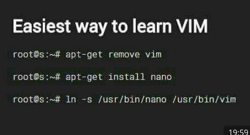
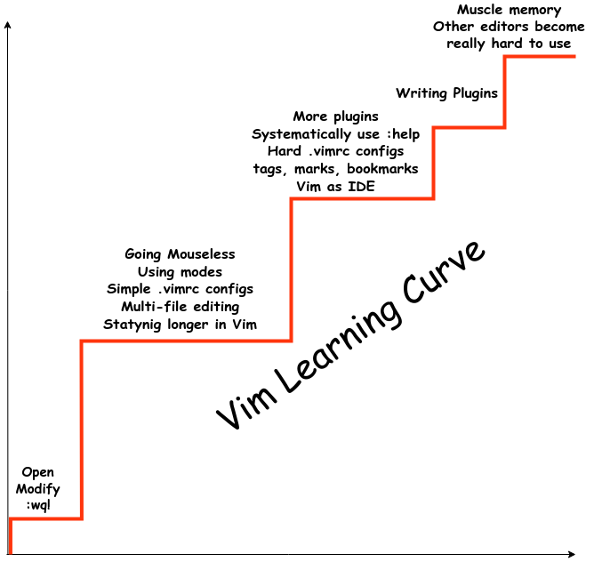

# Vim Presentation

## Inspiration

* [Mastering the vim language](https://www.youtube.com/watch?v=wlR5gYd6um0)

## History of Vim

* Started with `ed`.  Written by Ken Thompson and others of Bell Labs in 1971
    for Unix.
  * Short for "editor" because they needed one, so they wrote it (actually
    adapted from `qed`).
  * Notoriously terse: Shows one line at a time, and you have to query the file
      you're editing.  Why?  Teletype.
  * But supported regular expressions.  Actually the origin of the word "grep".
* Starting the trend of these things one-upping each other with their names,
  `ex` was "ed extended".  Developed by Bill Joy in 1976.
  * Still one-line at a time, but much more feature-rich.
  * Many of the features are familiar to modern day users of `vim`.  In
    particular, `ex` added the colon for entering commands, as well as marks and
    tags.
* `ex` eventually implemented a fullscreen mode, accessed with the command `vi`.
    This began the evolution of `ex` into `vi`.
  * Introduced modes (insert/normal).
  * Recognizable to the modern day user, although very feature poor compared to
      modern `vim`.
* `vi` was rewritten for lots of different systems and eventually in 1986, Bram
    Moolenaar wrote `vim`, which was a port of `stevie`, which was a port of
    `vi`.  `vim` has a much expanded feature set, including syntax highlighting
    and a "visual select" mode.  It has been updated ever since and is on
    version 8 currently.
  * Standard text editor for nearly all linux systems.
  * (Maybe?) introduced vimscript, which allowed the editor to be extended via
    plugins and settings.
* While `vim` is still actively maintained, in 2015, `neovim` released its first
    public release.  This is an ongoing project which seeks to "aggresively"
    refactor and modernize the `vim` codebase.  Naturally, people are angry
    about it, but it is superior to vim for a few reasons:
  * Gets rid of the "benevolent dictator" problem and has a more open community.
  * It has an API which allows it to be embedded into GUI editors like IDEs.
  * Supports an embedded terminal emulator.
  * Support for asynchronous job control, which allows for LSP plugins.
  * Refactored codebase drops support for a bunch of obselete hardware and will
      be maintainable going forward.
  * Super popular on linux youtube.

### My History with Vim

* Started in 2015 because I got cool-shamed into using it for LaTeX.
* Learned some basic commands, mostly for configuring the look and feel, and
    used it more or less like any other text editor for a long time.
* Wrote my dissertation in vim.
* Got enough familiarity to use as a daily driver for python and general text
    editing (but not scala) by 2018.
* Gave up for a while and used Intellij + vim plugin, but I didn't like the lack
    of configurability of the vim bindings in Intellij.
* Learned about plugins and extensibility of vim and set up for scala
    development.

## Why Use It

1. Optimized for _editing_ text, not _writing_ text.
    1. Provides a language for changes
    2. Repeatable
    3. Undoable
2. Composable language
    1. EMACS, Atom, VSCode all focus on extensibility, but lack the composable
       lalanguage of vim
    2. Meantime, neovim is catching up in terms of extensibility as
       well.
3. Cross platform and lightweight.
4. Cool
5. Why not?

### Some Jokes





## Vim as a Grammar of Text Movement and Text Objects

"Typing is not the bottleneck, thinking is"  - Learning vim isn't about speed,
it's about expressive power without thought.

### High Level Paradigm

Vim is a **modal** text editor.  This means there are multiple layers of
interacting with your files.  Some of the common modes are:

* Normal mode (where you do text **editing**) - Esc
* Insert mode (where you do text **writing**) - i/I, a/A, s/S, etc.
* Visual mode (selecting text, etc.) - v/V, etc.
* Command mode (entering commands to the editor) ":"

### Basic Syntax

Verb + Noun.

For example: `d` for "delete" and "w" for word combine to produce the command
`dw` for "delete word"

* Repeat commands with `.`
* Undo commands with `u`
* Redo commands with `Ctrl+r`

### Verbs in Vim

* `d` - Delete
* `c` - Change (delete + inter insert mode)
* `>` - Indent
* `v` - Select
* `y` - Yank (copy)

### Movement Nouns

* `w` - word (forward by one word object)
* `e` - end of word (forward to end of current/next word object)
* `0`, `^`, `$` - Beginning/end of line
* `gg`, `G` - Beginning/end of document
* `b` - back (backward by one word object)
* `h`, `j`, `k`, `l` - character movements
* `{`, `}` - Skip paragraph
* `(`, `)` - Skip sentence

These can be repeated within commands, too.  For instance `2dw` and `d2w` both
mean delete 2 words.  But only `c2w` means "change two words."

### Text Object Nouns

Those were all simple, but this is where you start to see the expressive power.

* `iw` - "inside word" (also `aw` to include whitespace)
* `i"` - "inside quotes".  Similarly `i{`, `i(`, etc.  These are super useful in
    coding.  Aso `a"`, etc. to include enclosing characters.
* `ip` - "inside paragraph" (also `ap` to include whitespace)
* `is`, `as` - inside/around sentence.

### Parameterized Text Objects

* `f`, `F` - "find" the next character
* `t`, `T` - "until" the next character (think 'till)
* `/` - Search through the document for a match

These can also be repeated, for instance `c2t)` will change until the second
closing parenthesis after the cursor.

### Moving around

* `Ctrl+e`, `Ctrl+y` - Scroll the page around
* `Ctrl+f`, `Ctrl+b` - Page up/down
* `Ctrl+u`, `Ctrl+d` - Half page up/down
* `H`, `M`, `L` - Top, middle, bottom of text
* `zt`, `zz`, `zb` - Move current line to top, middle, bottom

### Advanced Topics

1. Macros: Record with `qq`.  Replay with `@q`
2. Relative numbers
3. Marks
4. Remap commands and write your own.

## Configuring Vim

TLDR: Use [Vim-plug](https://github.com/junegunn/vim-plug).  It is a very
easy-to-use plugin manager by github superuser junegunn (who also writes lots of
other good plugins).  Once installed, you can simply place statements like `Plug
'tpope/commentary.vim'` in your vimrc and run the install command.  The string
specifies a partial or complete github URL to a published vim plugin.

### Initial setup

Run this command.

**WARNING:** If you already have a vim config, you should back it up first.

```bash
curl -fLo ~/.vim/autoload/plug.vim --create-dirs \
    https://raw.githubusercontent.com/junegunn/vim-plug/master/plug.vim
```

## Good Practice

Map plugin commands to leader, g-space, or control/alt+.  Don't go too crazy
with plugins (like I have).
